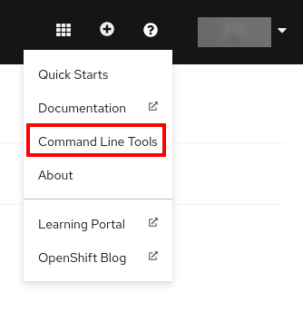
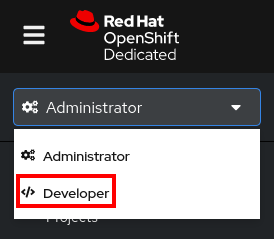
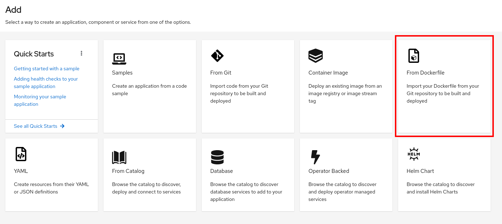
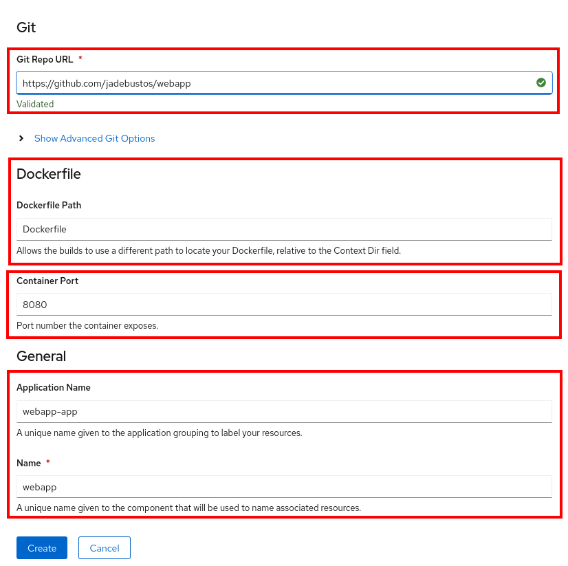
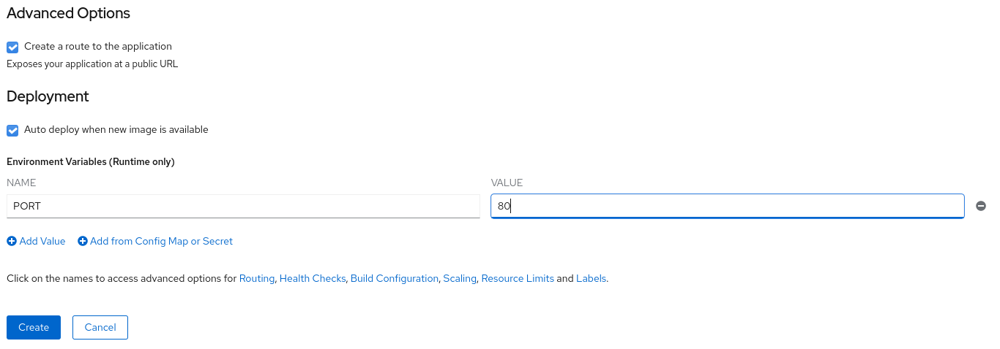
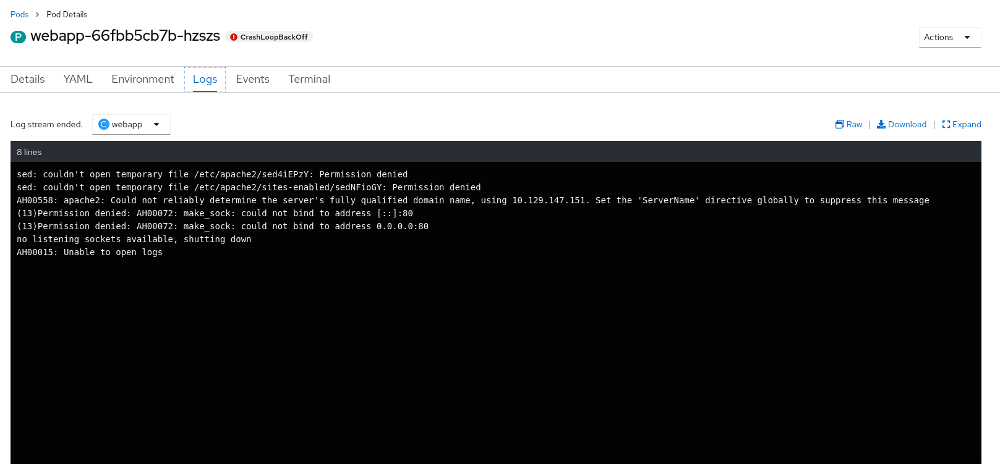
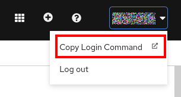
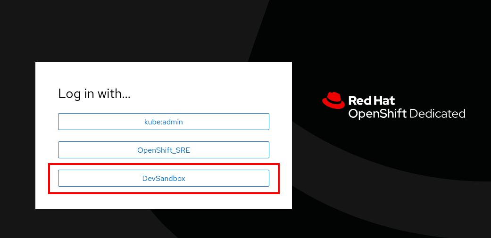

# OpenShift Developer Sandbox

[OpenShift Developer Sandbox(https://developers.redhat.com/developer-sandbox)] es un servicio, actualmente en estado beta, que nos permite "tener un cluster OpenShift" para poder probar aplicaciones.

Los recursos que vamos a poder utilizar se encuentran limitados.

Podemos crear una cuenta personal para utilizarlo e iniciar sesión.

## Instalando el CLI

El CLI no es necesario, pero si se quiere realizar alguna operación a nivel de consola será necesario instalarlo.

Para instalarlo una vez iniciada sesión si vamos a la esquina superior derecha y pinchamos en el circulo con una interrogación al lado del nombre del usuario nos apareceraá un menú en **Command Line Tools** tendremos los enlaces para descargar **oc** para nuestro sistema operativo.



## Construyendo y desplegando una aplicación desde un Dockerfile

Vamos a utilizar como ejemplo la aplicación en el repositorio de git [webapp](https://github.com/jadebustos/webapp). Es la misma aplicación que hemos utilizado en la parte de docker.

Una vez hemos iniciado la sesión en OpenShift cambiamos a la vista de **Developer**:



Pinchamos en **+Add** y luego seleccionamos **From Dockerfile**:



A continuación rellenamos los datos de la aplicación:



+ **Git Repo URL** repositorio de git donde se encuentra el Dockerfile. Si el repositorio es privado en **Show Advanced Git Options** se pueden configurar más opciones.
+ **Dockerfile** ruta dentro del repositorio al Dockerfile.
+ **Container Port** será el puerto por el que será accesible la aplicación desde el exterior.
+ **Application Name** nombre de la aplicación.
+ **Name** etiqueta que se utilizará para etiquetar todos los recursos asociados a la aplicación.


+ Como tenemos definida una variable de entorno, tendremos que especificarla y lo haremos en **Deployment**.



+ Añadimos las variables con los valores.

+ Y por último **Create** para construir la aplicación.

Nos puede sar un error similar a este:


Cambiar a la vista de **Administrador** e ir a **Workloads -> Pods**:


Si pinchamos sobre el Pod que tiene el error y vamos a **Logs** podemos ver el error:



Para tener más información y poder depurar lo mejor es irse al CLI:

```bash
[jadebustos@archimedes ocp]$ ./oc debug deployment/webapp
Starting pod/webapp-debug ...
Pod IP: 10.129.147.158
If you don't see a command prompt, try pressing enter.

$ pwd
/var/www/html
$ ls -lh ../public
total 4.0K
-rw-r--r--. 1 www-data www-data 116 Jan 21 14:15 index.php
$ whoami
1008520000
$ echo "hola" >> /etc/apache2/sites-enabled/000-default.conf
/bin/sh: 7: cannot create /etc/apache2/sites-enabled/000-default.conf: Permission denied
$ ls -lh /etc/apache2/sites-enabled/000-default.conf
lrwxrwxrwx. 1 root root 35 Jan 12 01:40 /etc/apache2/sites-enabled/000-default.conf -> ../sites-available/000-default.conf
$ 
```

Si vamos ahora a la vista de **Administrador** y a **Workloads -> Pods** podemos ver el pod que ha lanzado el proceso de debug:


El problema que estamos teniendo es que como el ENTRYPOINT no se ejecuta como root no va a poder sobreescribir el fichero de configuración del virtualhost y por lo tanto el apache se va a intentar arrancar en el puerto 80 que al ser un puerto privilegiado, por debajo del 1024, solo el usuario root puede levantar servicios en esos puertos.

Como la imagen base que hemos cogido está pensada para docker y los cambios que hicimos también al requerir de privilegios de root para realizar los cambios no funcionará en OpenShift y será necesario realizar cambios.

Tendremos dos opciones, una de ellas es crear una [Service Account](https://docs.openshift.com/container-platform/4.6/authentication/using-service-accounts-in-applications.html) que nos permita la ejecución como root. En el Sandbox de OpenShift esto no es posible.

Para hacerlo funcionar vamos a realizar un cambio muy sencillo **Y QUE NUNCA DEBERIAMOS HACER** vamos a modificar el Dockerfile de la siguiente manera:

```
FROM php:7-apache
MAINTAINER mantainer@email
ENV PORT=80
COPY virtualhost.conf /etc/apache2/sites-available/000-default.conf
COPY index.php /var/www/public/index.php
COPY start-apache.sh /usr/local/bin/start-apache
RUN chown -R www-data:www-data /var/www
RUN chmod 755 /usr/local/bin/start-apache
RUN chmod 777 -R /etc/apache2/
ENTRYPOINT ["start-apache"]
```

Salimos del pod de debug.

La guía para crear imágenes para OpenShift se puede encontrar en la [documentación](https://docs.openshift.com/container-platform/4.6/openshift_images/create-images.html).

Borramos el deployment y volvemos a desplegar pero especificando un puerto por encima del 1024:


## Autenticación para utilizar el CLI

El siguiente flujo nos lleva al comando oc para hacer login:






## Borrando un deployment completo desde el CLI

Antes de borrrar es buena idea comprobar antes que vamos a borrar. Para ello vamos a utilizar la etiqueta, en este caso **app=webapp**:

```bash
[jadebustos@beast ocp]$ ./oc project abustosp-dev
Now using project "abustosp-dev" on server "https://api.sandbox.x8i5.p1.openshiftapps.com:6443".
[jadebustos@beast ocp]$ ./oc get all -l webapp
No resources found in abustosp-dev namespace.
[jadebustos@beast ocp]$ ./oc get all -l app=webapp
NAME                         READY   STATUS    RESTARTS   AGE
pod/webapp-775776c94-nwwmz   1/1     Running   0          61m

NAME             TYPE        CLUSTER-IP       EXTERNAL-IP   PORT(S)    AGE
service/webapp   ClusterIP   172.30.212.146   <none>        8081/TCP   65m

NAME                     READY   UP-TO-DATE   AVAILABLE   AGE
deployment.apps/webapp   1/1     1            1           65m

NAME                                DESIRED   CURRENT   READY   AGE
replicaset.apps/webapp-5f5468d676   0         0         0       65m
replicaset.apps/webapp-775776c94    1         1         1       61m
replicaset.apps/webapp-7d577658bc   0         0         0       63m

NAME                                    TYPE     FROM   LATEST
buildconfig.build.openshift.io/webapp   Docker   Git    1

NAME                                TYPE     FROM          STATUS     STARTED             DURATION
build.build.openshift.io/webapp-1   Docker   Git@8dd6a83   Complete   About an hour ago   1m22s

NAME                                    IMAGE REPOSITORY                                                                                    TAGS     UPDATED
imagestream.image.openshift.io/webapp   default-route-openshift-image-registry.apps.sandbox.x8i5.p1.openshiftapps.com/abustosp-dev/webapp   latest   About an hour ago

NAME                              HOST/PORT                                                    PATH   SERVICES   PORT       TERMINATION   WILDCARD
route.route.openshift.io/webapp   webapp-abustosp-dev.apps.sandbox.x8i5.p1.openshiftapps.com          webapp     8081-tcp                 None
[jadebustos@beast ocp]$ 
```

Una vez que vemos que esta todo ok, y que no hay nada etiquetado con la etiqueta que vamos a utilizar que no debamos borrar procedemos a borrar:

```bash
[jadebustos@beast ocp]$ ./oc delete all -l app=webapp
pod "webapp-775776c94-nwwmz" deleted
service "webapp" deleted
deployment.apps "webapp" deleted
buildconfig.build.openshift.io "webapp" deleted
imagestream.image.openshift.io "webapp" deleted
route.route.openshift.io "webapp" deleted
[jadebustos@beast ocp]$ 
```

Lo único que quedaría por borrar son los secrets:

```bash
[jadebustos@beast ocp]$ ./oc get secrets
NAME                            TYPE                                  DATA   AGE
builder-dockercfg-fv89f         kubernetes.io/dockercfg               1      19h
builder-token-b5bm2             kubernetes.io/service-account-token   4      19h
builder-token-k6hn4             kubernetes.io/service-account-token   4      19h
default-dockercfg-25w9t         kubernetes.io/dockercfg               1      19h
default-token-bs8g7             kubernetes.io/service-account-token   4      19h
default-token-f257n             kubernetes.io/service-account-token   4      19h
deployer-dockercfg-vs8hh        kubernetes.io/dockercfg               1      19h
deployer-token-t8bzh            kubernetes.io/service-account-token   4      19h
deployer-token-vqlw6            kubernetes.io/service-account-token   4      19h
webapp-generic-webhook-secret   Opaque                                1      70m
webapp-github-webhook-secret    Opaque                                1      70m
[jadebustos@beast ocp]$ ./oc delete secrets webapp-generic-webhook-secret
secret "webapp-generic-webhook-secret" deleted
[jadebustos@beast ocp]$ ./oc delete secrets webapp-github-webhook-secret
secret "webapp-github-webhook-secret" deleted
[jadebustos@beast ocp]$ 
```